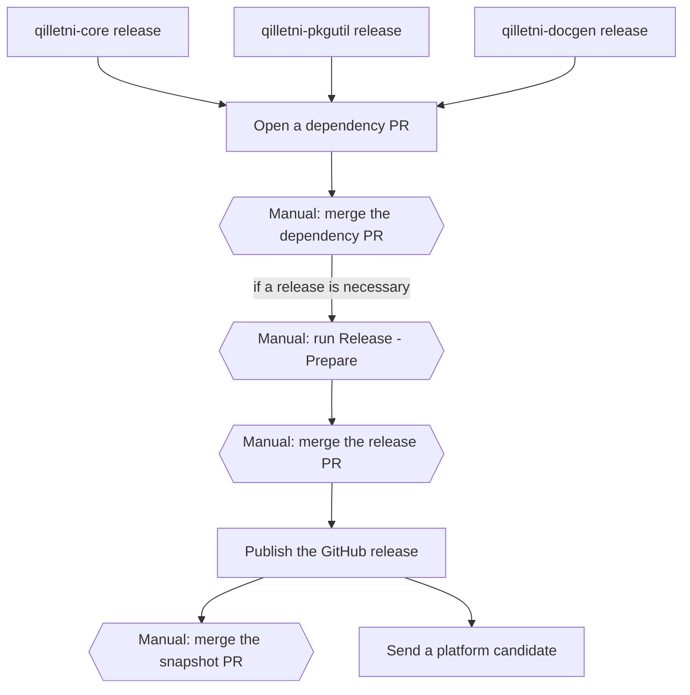

# QilletniToolchain Release Protocol

QilletniToolchain is a producer repository in the Qilletni release process. The shared
procedure is in the [Qilletni release document][main]. This document gives only the facts
for this repository.

## This repository

| Item | Value |
| --- | --- |
| Component | `qilletni-toolchain` |
| Kind | `cli` |
| Version | `toolchainVersion` in `gradle.properties` |
| Publishes to | a GitHub release. This repository publishes nothing to Maven Central. |
| Release assets | `qilletni-X.Y.Z.tar.gz`, `QilletniToolchain.jar`, `toolchain-logging-X.Y.Z.jar`, `component-manifest.json`, `bom.json` |
| Snapshots | the `snapshot` GitHub prerelease, replaced for each push to `master` |
| Jobs in `release.yml` | `tag-release`, `publish-snapshot`, `build-and-publish`, `platform-dispatch`, `snapshot-followup` |
| Lockfiles | `gradle.lockfile`, `toolchain-logging/gradle.lockfile` |
| Pull request checks | `pr-ci.yml` |

## Overview



- A hexagon with "Manual:" is a step that the maintainer does.
- A rectangle is a step that a workflow does.

## Prepare and publish a release

1. Write the changes in the `## [Unreleased]` section of `CHANGELOG.md`. For a major bump,
   also write `docs/migrations/X.Y.Z.md`. **(manual)**
2. Run the `Release - Prepare` workflow. Select the bump. **(manual)**
   Refer to [Prepare a release][prepare].
3. Examine the release PR, then merge it. **(manual)**
4. The `tag-release` job creates the tag. The `build-and-publish` job creates the GitHub
   release. Refer to [Publish a release][publish].

<details>
    <summary>What does this do?</summary>

The `build-and-publish` job in this repository is different from the job in Qilletni:

- It gets the last release version from the tags of this repository, because there is no
  Maven registry.
- It runs the japicmp gate only for `toolchain-logging`. For more data, refer to
  [Select the bump](#select-the-bump).
- It makes `component-manifest.json`. The manifest records this version, the versions of
  the embedded components and the source commit. The archive contains the manifest, and
  the release also attaches it as an asset.
- It makes `qilletni-X.Y.Z.tar.gz`. The archive contains the jar, the manifest and the
  launcher scripts.

`qilletni --version` shows this version, the embedded component versions and the source
commit.

</details>

5. The `platform-dispatch` job sends a platform candidate to Qilletni. Merge the candidate
   PR in Qilletni. **(manual)** Refer to [Release the platform][platform].
6. The `snapshot-followup` job opens the snapshot PR. Merge it. **(manual)**

No repository consumes `qilletni-toolchain` as a dependency. A release of this repository
opens no dependency PR.

### Select the bump

The japicmp gate examines only the public API of `toolchain-logging`.

| Bump | The japicmp gate stops the release if |
| --- | --- |
| `patch` | the `toolchain-logging` API has a change of any type |
| `minor` | the `toolchain-logging` API has an incompatible change |
| `major` | the `toolchain-logging` API has an incompatible change and `docs/migrations/X.Y.Z.md` does not exist |

<details>
    <summary>What does this do?</summary>

- The gate compares with `toolchain-logging-X.Y.Z.jar` from the last GitHub release of
  this repository.
- Each release attaches this jar, so that the next release has a baseline.
- If no earlier release has the jar, the gate does not run. The job never makes a baseline.

</details>

## Consume upstream releases

This repository consumes three upstream components.

| Upstream component | Producer repository | Version key | Coordinates |
| --- | --- | --- | --- |
| `qilletni-core` | Qilletni | `qilletniCoreVersion` | `dev.qilletni.impl:qilletni`, `dev.qilletni.api:qilletni-api` |
| `qilletni-pkgutil` | QilletniPackageUtility | `qilletniPkgutilVersion` | `dev.qilletni.pkgutil:qilletni-pkgutil` |
| `qilletni-docgen` | QilletniDocgen | `qilletniDocgenVersion` | `dev.qilletni.docgen:qilletni-docgen` |

The two `qilletni-core` coordinates use one version key, because Qilletni releases them
together.

1. The `Dependency Update` workflow opens a dependency PR for each upstream release.
   Refer to [Update the consumer repositories][consumers].
2. Examine the dependency PR, then merge it. **(manual)**
3. Decide if this repository needs a release. If yes, do
   [Prepare and publish a release](#prepare-and-publish-a-release). **(manual)**

## Dependency locks

The two lockfiles record the exact dependency graph of a release. After a dependency
change, refresh both lockfiles:

```bash
./gradlew dependencies --write-locks -PincludeSiblingBuilds=false
./gradlew :toolchain-logging:dependencies --write-locks -PincludeSiblingBuilds=false
```

The `Dependency Update` workflow refreshes both lockfiles automatically.

## Local development

- `-PincludeSiblingBuilds=true` builds against the sibling checkouts `../Qilletni`,
  `../QilletniPackageUtility` and `../QilletniDocgen`.
- `-PuseMavenLocal=true` builds against artifacts in the local Maven repository.

Both flags are `false` by default. The release workflows and the `pr-ci.yml` workflow
always set `-PincludeSiblingBuilds=false`.

## Links

- [Qilletni release document][main]
- [`release/components.yml`](https://github.com/Qilletni/Qilletni/blob/master/release/components.yml)
- [`tools/release/README.md`](https://github.com/Qilletni/ReleaseTooling/blob/master/README.md)

[main]: https://github.com/Qilletni/Qilletni/blob/master/RELEASE.md
[prepare]: https://github.com/Qilletni/Qilletni/blob/master/RELEASE.md#prepare-a-release
[publish]: https://github.com/Qilletni/Qilletni/blob/master/RELEASE.md#publish-a-release
[consumers]: https://github.com/Qilletni/Qilletni/blob/master/RELEASE.md#update-the-consumer-repositories
[platform]: https://github.com/Qilletni/Qilletni/blob/master/RELEASE.md#release-the-platform
